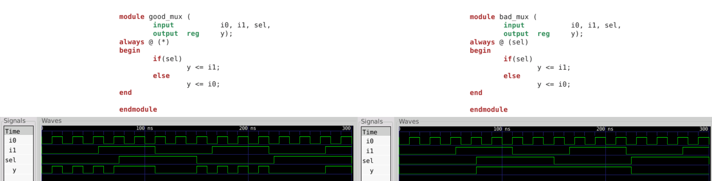
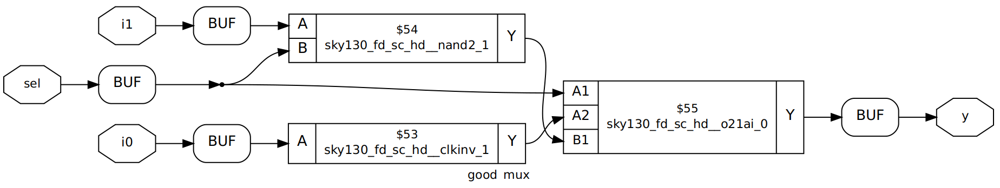
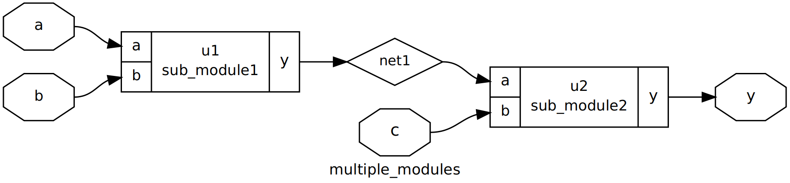
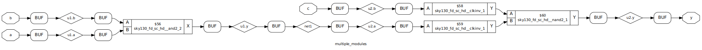

# Open Source RTL Design
This repository contains the usage of tools like iverilog, gtkwave and yosys for open-source RTL Design. The content is documentation of tasks carried out during VSD "RTL Design Using Verilog With SKY130 Technology".

## Table of Contents

- [Open Source Tool Chain](#Open-Source-Tool-Chain)
  * [iverilog](#iverilog)
  * [gtkwave](#gtkwave)
  * [sky130 libraries](#sky130-libraries)
  * [yosys](#yosys)
- [Modelling Techniques](#Modelling-Techniques)
  * [Modelling Combinational Logic](#Modelling-Combinational-Logic)
- [Synthesis Techniques](#Modelling-Techniques)
  * [Hierarchial Synthesis](#Hierarchial-Synthesis)
  * [Flat Synthesis](#Flat-Synthesis)
  * [Submodule Level Synthesis](#Submodule-Level-Synthesis)

## Open Source Tool Chain

Usually front-end RTL design is carried out using huge EDA Tools from different vendors. Even though many of the tools come with free limited versions its better to give a try for development using open-source tools. Below is the list of tools used by this repo.

### iverilog

iverilog is the tool used for compiling and simulation purpose. Simulation is the process of creating models that mimic the behavior of the device. Tool performs macro preprocessing, compilation, elaboration, optional optimizations and finally code generation. For more details about the tool refer the [wiki](https://iverilog.fandom.com/wiki/User_Guide).

* Use following command to install iverilog on Ubuntu machine

```
sudo apt install iverilog
```

* Compile the design files and associated test bench using following command, it produces a executable

```
iverilog design_file.v test_bench.v
```

* Execute the a.out file to produce vcd file

```
./a.out
```

### gtkwave

The simulator generates value change dump (.vcd) file this can be viewed as wave using gtkwave waveform viewer.

* Use following command to install gtkwave on Ubuntu machine

```
sudo apt install gtkwave
```

* Run following command to view the waveform

```
gtkwave test_bench.vcd
```

### sky130 libraries

sky130 pdk library is used for mapping the purpose during synthesis. The design gets mapped to standard cell definitions present in "sky130_fd_sc_hd__tt_025C_1v80.lib" library. The necessary files for synthesis are well organized in the [git repository](https://github.com/kunalg123/sky130RTLDesignAndSynthesisWorkshop.git). For further details about the library refer [wiki](https://skywater-pdk.readthedocs.io/en/latest/contents.html).

* Clone the repository using following command

```
git clone https://github.com/kunalg123/sky130RTLDesignAndSynthesisWorkshop.git
```

### yosys

yosys is used for synthesis. Synthesizer takes the design file and technology library file as input and produces netlist. Syntesis is the process in which the design is mapped to standard cells defined in the technology library. Here we are using SKY130 Technology library file. For further details about the tool refer the [documentation](http://www.clifford.at/yosys/documentation.html).

* Use following command to install yosys on Ubuntu machine

```
sudo apt install yosys
```

* Invoke yosys by running following command

```
yosys
```

* Read library using following command

```
read_liberty -lib my_lib/lib/sky130_fd_sc_hd__tt_025C_1v80.lib
```

* Read design files using following command

```
read_verilog ../design_file.v
```

* Synthesize the design module

```
synth -top design_file
```

* Generate the netlist

```
abc -liberty my_lib/lib/sky130_fd_sc_hd__tt_025C_1v80.lib
```
* View the realized logic

```
show
```

## Modelling Techniques

### Modelling Combinational Logic

To properly model any combinational logic in verilog the sensitivity list must contain all inputs, else the design will not function as expected. To demonstrate this concept consider a simple multiplexer as example. Below figure shows good and bad modelling style along with the simulation waveform. Left side of the figure has proper verilog code for the mux. The code shown in right side has only select input in sensitivity list hence the output will not change if select input is constant and inputs are changing.



Below figure shows the logical representation of the design after performing synthesis.




## Synthesis Techniques

Consider a simple example `multiple_modules` which instntiates two modules `sub_module1` and `sub_module2`. The sub-modules realize and logic and or logic respectively.

### Hierarchial Synthesis

Hierarchial synthesis can be performed using yosys by following the steps mentioned in [above section](#yosys). When there are more than one modules we need to explicitly mention the name of the module while running `show` command. The show command does not show the internals of the submodules, it is maintaining hierarchial representation.

```
show multiple_modules
```



The netlist can be written using following command. By observing the netlist we can confirm that hierarchial representation is retained.

```
write_verilog -noattr multiple_modules_hier.v
```
### Flat Synthesis

Run the below command to flatten the synthesized design

```
flatten
```
The synthesized design looks as shown below if we run `show` command after flattening the design. Even the netlist will be flattened and this can be viewed by writing the netlist.



### Submodule Level Synthesis

Submodule level synthesis comes handy in several cases, if same submodule is instantiated many times within the module then we can synthesize the submodule only once using the submodule level synthesis. Consider another case where the design is very large and produces non-optimal netlist when synthesis is performed at once, here we can synthesize the submodules seperatly to produce optimal netlist.

Submodule synthesis can be performed using yosys by following same steps mentioned in [above section](#yosys). But we need to provide required submodule for `synth -top` command.


