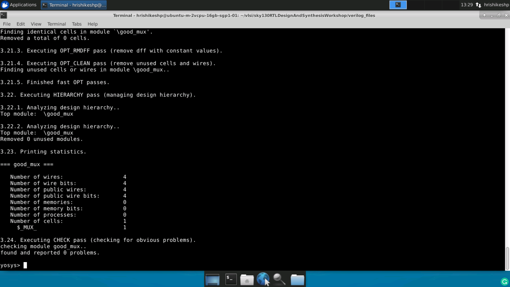
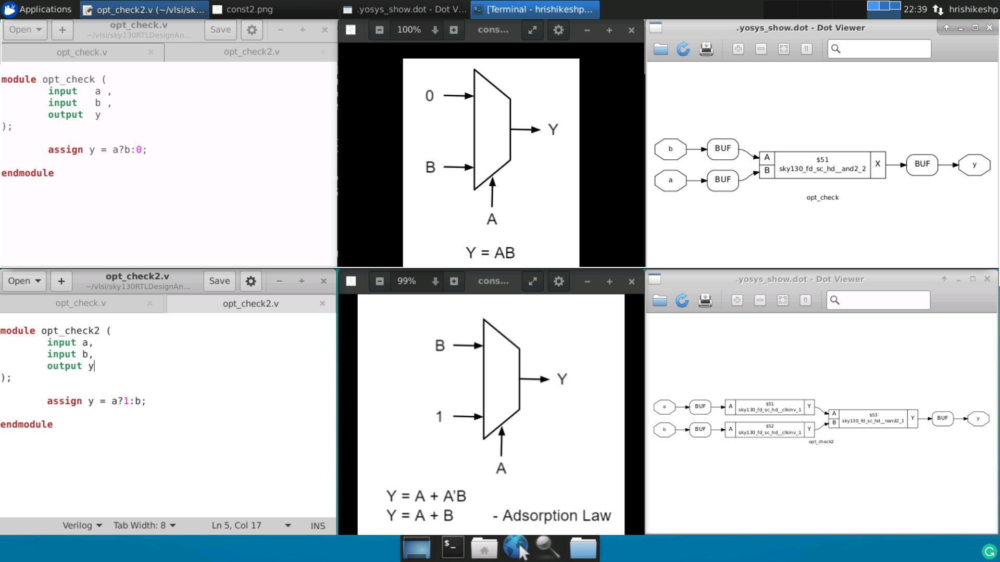
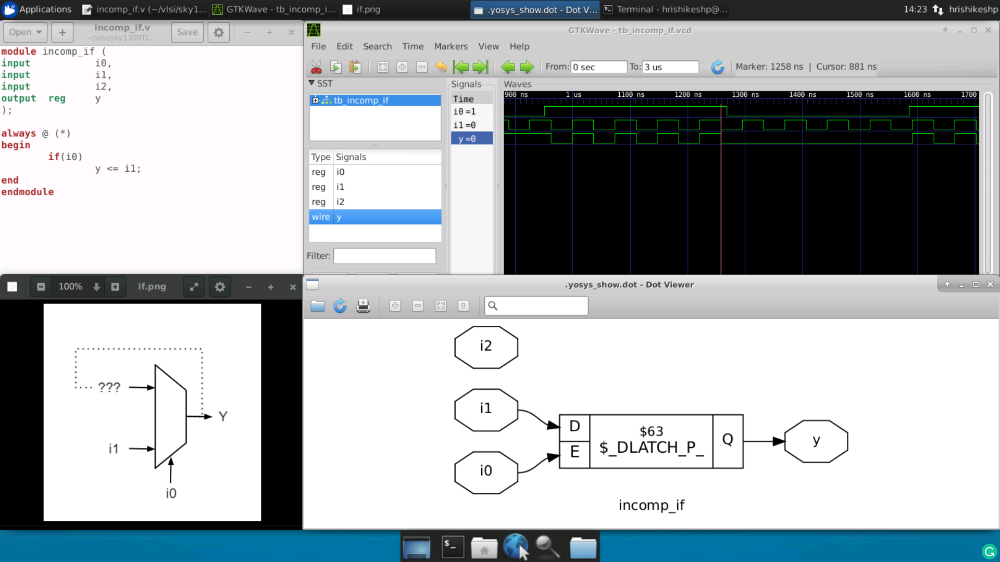

# Open Source RTL Design
This repository contains the usage of tools like iverilog, gtkwave and yosys for open-source RTL Design. The content is documentation of tasks carried out during VSD "RTL Design Using Verilog With SKY130 Technology".

## Table of Contents

- [Open Source Tool Chain](#Open-Source-Tool-Chain)
  * [iverilog](#iverilog)
  * [gtkwave](#gtkwave)
  * [sky130 libraries](#sky130-libraries)
  * [yosys](#yosys)
- [Modelling Techniques](#Modelling-Techniques)
  * [Sensitivity List for Combinational Logic](#Sensitivity-List-for-Combinational-Logic)
  * [Modelling Flip Flops](#Modelling-Flip-Flops)
- [Synthesis Techniques](#Synthesis-Techniques)
  * [Hierarchial Synthesis](#Hierarchial-Synthesis)
  * [Flat Synthesis](#Flat-Synthesis)
  * [Submodule Level Synthesis](#Submodule-Level-Synthesis)
- [Beauty of Optimizations](#Beauty-of-Optimizations)
  * [Synthesizing Multipliers](#Synthesizing-Multipliers)
  * [Combinational Logic Optimization](#Combinational-Logic-Optimization)
  * [Sequential Logic Optimization](#Sequential-Logic-Optimization)
  * [Unuesd Output Optimization](#Unuesd-Output-Optimization)
- [Gate Level Simulation (GLS)](#Gate-Level-Simulation-(GLS))
  * [Incomplete Sensitivity List](#Incomplete-Sensitivity-List)
  * [Blocking Assignments](#Blocking-Assignments)
- [Behavioural Modelling Constructs](#Behavioural-Modelling-Constructs)
  * [If Statement and Inferred Latches](#If-Statement-and-Inferred-Latches)
  * [Case and its Associated Caveats](#Case-and-its-Associated-Caveats)
  * [for and for generate](#for-and-for-generate)

## Open Source Tool Chain

Usually front-end RTL design is carried out using huge EDA Tools from different vendors. Even though many of the tools come with free limited versions its better to give a try for development using open-source tools. Below is the list of tools used by this repo.

### iverilog

iverilog is the tool used for compiling and simulation purpose. Simulation is the process of creating models that mimic the behavior of the device. Tool performs macro preprocessing, compilation, elaboration, optional optimizations and finally code generation. For more details about the tool refer the [wiki](https://iverilog.fandom.com/wiki/User_Guide).

* Use following command to install iverilog on Ubuntu machine.

```
sudo apt install iverilog
```

* Compile the design files and associated test bench using following command, it produces a executable.

```
iverilog design_file.v test_bench.v
```

* Execute the a.out file to produce vcd file.

```
./a.out
```

### gtkwave

The simulator generates value change dump (.vcd) file this can be viewed as wave using gtkwave waveform viewer.

* Use following command to install gtkwave on Ubuntu machine.

```
sudo apt install gtkwave
```

* Run following command to view the waveform.

```
gtkwave test_bench.vcd
```


### sky130 libraries

sky130 pdk library is used for mapping the purpose during synthesis. The design gets mapped to standard cell definitions present in "sky130_fd_sc_hd__tt_025C_1v80.lib" library. The necessary files for synthesis are well organized in the [git repository](https://github.com/kunalg123/sky130RTLDesignAndSynthesisWorkshop.git). For further details about the library refer [wiki](https://skywater-pdk.readthedocs.io/en/latest/contents.html).

* Clone the repository using following command.

```
git clone https://github.com/kunalg123/sky130RTLDesignAndSynthesisWorkshop.git
```

### yosys

yosys is used for synthesis. Synthesizer takes the design file and technology library file as input and produces netlist. Syntesis is the process in which the design is mapped to standard cells defined in the technology library. Here we are using SKY130 Technology library file. For further details about the tool refer the [documentation](http://www.clifford.at/yosys/documentation.html).

* Use following command to install yosys on Ubuntu machine.

```
sudo apt install yosys
```

* Invoke yosys by running following command.

```
yosys
```

* Read library using following command, number of cells imported will be displayed after successful run.

```
read_liberty -lib my_lib/lib/sky130_fd_sc_hd__tt_025C_1v80.lib
```

* Read design files using following command, `Successfully finished Verilog frontend` message will be displayed if run is successful.

```
read_verilog ../design_file.v
```

* Synthesize the design module by running below command. View the statistics printed.

```
synth -top design_file
```



* Generate the netlist, view the standard cells mapped.

```
abc -liberty my_lib/lib/sky130_fd_sc_hd__tt_025C_1v80.lib
```


* View the realized logic using below command.

```
show
```


**Note** : Due to different optimization techniques used the synthesizer may implement different logic when synthesized using different tool versions.

## Modelling Techniques

### Sensitivity List for Combinational Logic

To properly model any combinational logic using verilog the sensitivity list must contain all inputs, else the design will not function as expected. To demonstrate this concept consider a simple multiplexer as example. Below figure shows improper modelling style along with the waveform. It is evident that the output changes only when select input changes and is unaffected by changing only inputs which is not expected.


In proper modelling all the input ports must be present in sensitivity list and output must change as soon as any of the input changes.


### Modelling Flip Flops

Flip Flops are basic sequential elements which are capable of storing single bit of data. They come handy even in avoiding glitches in the combinational logic. To define the initial state of flip flops set and reset inputs are used and they can be modelled as either synchronous or asynhronous with the clock input.

Steps for synthesis remain same as mentioned in [above section](#yosys), but after performing `synth -top` we need to mention the library for flip flops using command shown below. This extra step is required when there are flops in the design because, usually there will be a seperate library for flip flops under standard cell library, but in our case there is only one library for everything.

```
dfflibmap -liberty my_lib/lib/sky130_fd_sc_hd__tt_025C_1v80.lib
```

Below figure shows verilog code for DFF with synchronous reset along with waveforms and synthesized logic.


Below figure shows verilog code for DFF with asynchronous set along with waveforms and synthesized logic.


## Synthesis Techniques

Consider a simple example `multiple_modules` which instntiates two modules `sub_module1` and `sub_module2`. The sub-modules realize and logic and or logic respectively.

### Hierarchial Synthesis

Hierarchial synthesis can be performed using yosys by following the steps mentioned in [above section](#yosys). When there are more than one modules we need to explicitly mention the name of the module while running `show` command. The show command does not show the internals of the submodules, it is maintaining hierarchial representation.

```
show multiple_modules
```

The netlist can be written using following command. By observing the netlist we can confirm that hierarchial representation is retained.

```
write_verilog -noattr multiple_modules_hier.v
```
### Flat Synthesis

Run the below command to flatten the synthesized design

```
flatten
```
The synthesized design looks as shown below if we run `show` command after flattening the design. Even the netlist will be flattened and this can be viewed by writing the netlist.


### Submodule Level Synthesis

Submodule level synthesis comes handy in several cases, if same submodule is instantiated many times within the module then we can synthesize the submodule only once using the submodule level synthesis. Consider another case where the design is very large and produces non-optimal netlist when synthesis is performed at once, here we can synthesize the submodules seperatly to produce optimal netlist.

Submodule synthesis can be performed using yosys by following same steps mentioned in [above section](#yosys). But we need to provide required submodule for `synth -top` command.

## Beauty of Optimizations

### Synthesizing Multipliers

We all know that multiplying by 2 is nothing but left shifting the input data by 1. Hence the design does not need any cells to implement this logic. Similarly there are some special cases when input data is 3 bit wide and multiplied by 9 then the result is nothing but replication of input data 2 times. The synthesizer is smart enough to optimize this kind of logic and it is evident from the below image.


### Combinational Logic Optimization

Combinational logic can be optimized using methods like Constant Propagation and Boolean Logic Optimization. If any one of the input to the combinational logic is tied to constant, then the logic will be optimized by the synthesizer. 

Before mapping to the library using `abc` make sure to run the below command, in order to perform optimization.

```
opt_clean -purge
```

Below are two examples of constant propagation optimization, in first case even thogh we try to implement mux the synthesizer optimizes the logic to and gate. In second case mux is optimized to or gate, but synthesizer preferes nand inmplementation of or logic for better logical effort.



Here is another example with multiple modules, in this case order of running commands is `synth -top` `flatten` `opt_clean -purge` `abc -liberty`


### Sequential Logic Optimization

Sequential logic can be optimized using methods like Sequential Constant Propagation, State Optimization, Retiming and Sequential Logic Cloning (Floor Plan Aware Synthesis). 

In case of sequential logic optimization, input tied to a constant always will not result in optimized result. Below is the example to demonstrate this, the DFF has asynchronous active high reset and D input is tied to high. It is evident from the simulation that if the reset is deasserted at any point the output goes high on next positive edge of clock. Hence the logic cannot be optimized. Consider the second example where DFF has active high set and D input tied to high, here as the output always remains high the logic is optimized.


Consider below example with 2 Flip Flops, where one has asynchronous reset and other has asynchronous set. Input of First D FF is held high, the logic cannot be optimized due to the Tcq (clock to out delay), the output will be low for one clock cycle.


Consider below example with 2 FFs, both having asynchronous set and D input of first flop tied to high. Even if we make set as high or low the output will always be high hence the logic gets optimized.


### Unuesd Output Optimization

In some cases all the outputs of the logic are not used, the synthesizer tries to optimize such kind of logic. Consider an example of 3-Bit up-conter where only least significant bit is of interest and is assigned to the output, rest 2 most significant bits of counter are not used. In this case the synthesizer optimizes the circuit to produce minimal logic required, instead of inferring 3 FF only one FF is inferred.


## Gate Level Simulation (GLS)
Gate Level Simulation is nothing but running testbench considering the netlist as design under test instead of RTL code. GLS needs to be performed to verify the logical correctness of the design after synthesis. It is used to find if there are any synthesis simulation mismatches. GLS is also used to ensure that the timing of the design is met, but to verify timing GLS needs to be run with delay annotation. To perform GLS using iverilog we need to provide the netlist along with the gate level verilog models of the standard cells and testbench while invoking `iverilog`. If gate level verilog models contain timing information then we can perform timing aware GLS but in our case we are only performing basic GLS to verify the logic. Synthesis simulation mismatch can occur due incomplete sensitivity list, blocking assignments and non stndard verilog.

### Incomplete Sensitivity List

Simulator and synthesizer work in a different way, during simulation the output changes when there is a change in the input. Simulation considers the sensitivity list while producing the result. Synthesizer does not consider the sensitivity list for combinational logic. Synthesizer just looks into the sensitivity list just to know whether its a combinaltional or sequential sensitivity list. Sensitivity list is made sequential by making it sensitive to edge i.e. by including posedge or negedge.

**Note:** Sensitivity list must be either pure sequential `always@(posedge clk, posedge rst)` or pure combinational `always@(a, b, reset)`, it should not include both constructs like `always@(posedge clk, reset)`.

Below are the simulation results of mux with only select input in sensitivity list, which produces synthesis simulation mismatch. Even though RTL code includes only select input in sensitivity list, synthesizer ignores sensitivity list, hence while GLS we get simulation synthesis mismatch.


### Blocking Assignments

Blocking assignments are evaluated sequentially and sometimes cause serious problems if they are not used properly. Consider combinational circuit example shown below, the verilog code tries to implement or gate followed by and gate. During simulation `d = x & c` is evaluated first hence the and gate considers previous value of `x` which is evident by waveforms. As it is a combinational logic the synthesizer implements it properly and the output does not depend on previous value. This causes synthesis simulation mismatch.


## Behavioural Modelling Constructs

### If Statement and Inferred Latches

If statement implements priority logic using multiplexers, where first if has highest priority and the last else has least priority. Every if statement must be associated with else statement, else latch will be inferred. The inferred latches are not expected in combinational logic, but sometimes inferred latches might be acceptable in case of sequential logic.

Consider below example, here we do not mention what must be assigned to output when `i0` is low hence the logic tries to latch the previous result. This causes a latch to be inferred which is not expected in combinational logic. By observing the waveforms it is eveident that when `i0` is low the output is latched. Here even though the we try to model mux D Latch is inferred.



### Case and its Associated Caveats

Case statement is realized using multplexers but unlike if statement it does not has any priority. Similar to if statement case statement has also has many problems and care must be taken while using it. In case of incomplete case and partial assignment latches will be inferred. Latches inferred due to incomplete case can be avoided using default case, but care must be taken to avoid partial assignments. Overlapping case also gives rise to problem when more than one condition evaluates to be true.

Below example shows how incomplete case staement leads to inferred latch. Here output is not assigned when `sel` is `10` and `11` hence previous output will be latched.


Below example demonstrates how partial case assignment will infer latch. In this case 2 different outputs are assigned using single select line, assignment of second output is not done for `01` case this causes a latch to be inferred.


Consider below example here there is overlap in the case, `1?` can either be `10` or `11`, but we have already included `10` thus the simulator will be confused and synthesizer may produce different result and thus causes simulation synthesis mismatch.


### for and for generate

There are two flavours of for loops in verilog, ithe functionality of for depends on where it is used. If for loop is used inside always block then it performs multiple evaluations, if for loop is used inside generate block then it replicates the hardware multiple times. The loopvariable in case of for generate should be genvar.

Below is an example where for loop is used inside always block to model demultiplexer.


Below is an example where for is used inside generate block to instntiate full adder multiple times to generate ripple carry adder.


