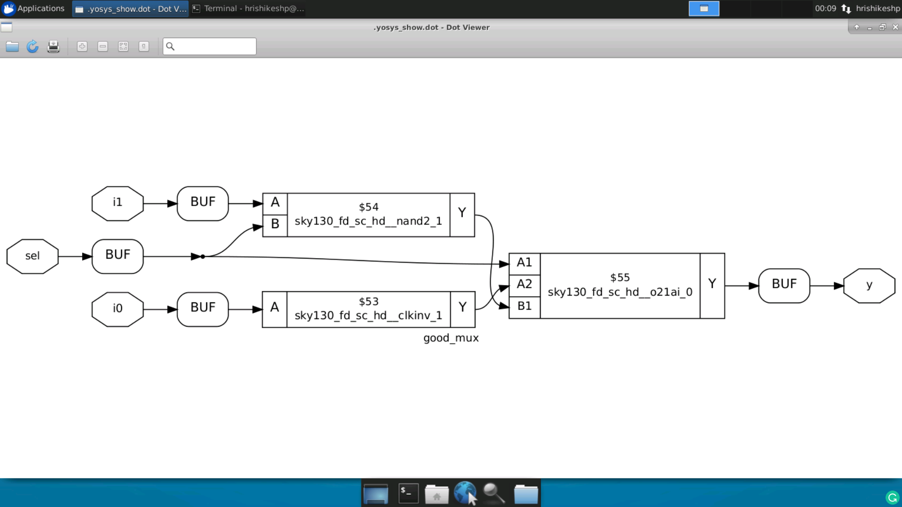
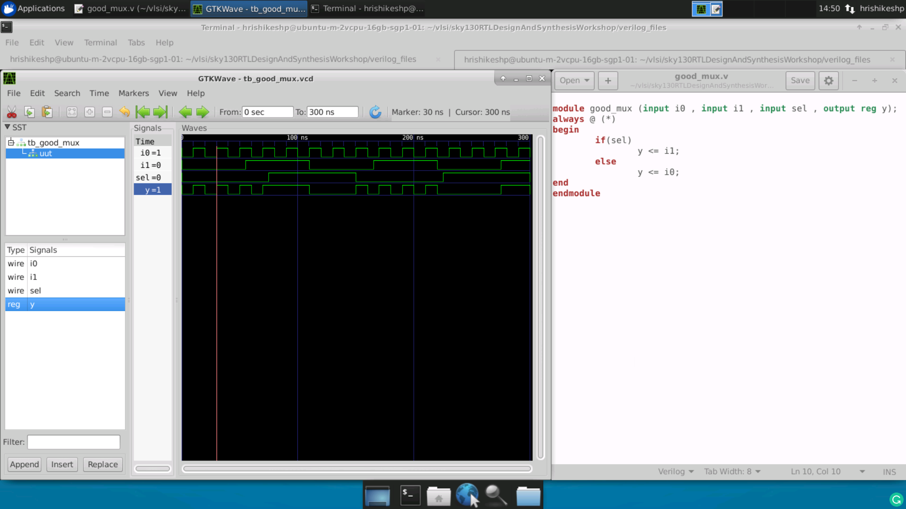

# Open Source RTL Design
This repository contains the usage of tools like iverilog, gtkwave and yosys for open-source RTL Design. The content is documentation of tasks carried out during VSD "RTL Design Using Verilog With SKY130 Technology".

## Table of Contents

- [Open Source Tool Chain](#Open-Source-Tool-Chain)
  * [iverilog](#iverilog)
  * [gtkwave](#gtkwave)
  * [sky130 libraries](#sky130-libraries)
  * [yosys](#yosys)
- [Modelling Techniques](#Modelling-Techniques)
  * [Sensitivity List for Combinational Logic](#Sensitivity-List-for-Combinational-Logic)
  * [Modelling Flip Flops](#Modelling-Flip-Flops)
- [Synthesis Techniques](#Synthesis-Techniques)
  * [Hierarchial Synthesis](#Hierarchial-Synthesis)
  * [Flat Synthesis](#Flat-Synthesis)
  * [Submodule Level Synthesis](#Submodule-Level-Synthesis)
- [Beauty of Optimizations](#Beauty-of-Optimizations)
  * [Synthesizing Multipliers](#Synthesizing-Multipliers)

## Open Source Tool Chain

Usually front-end RTL design is carried out using huge EDA Tools from different vendors. Even though many of the tools come with free limited versions its better to give a try for development using open-source tools. Below is the list of tools used by this repo.

### iverilog

iverilog is the tool used for compiling and simulation purpose. Simulation is the process of creating models that mimic the behavior of the device. Tool performs macro preprocessing, compilation, elaboration, optional optimizations and finally code generation. For more details about the tool refer the [wiki](https://iverilog.fandom.com/wiki/User_Guide).

* Use following command to install iverilog on Ubuntu machine.

```
sudo apt install iverilog
```

* Compile the design files and associated test bench using following command, it produces a executable.

```
iverilog design_file.v test_bench.v
```

* Execute the a.out file to produce vcd file.

```
./a.out
```

### gtkwave

The simulator generates value change dump (.vcd) file this can be viewed as wave using gtkwave waveform viewer.

* Use following command to install gtkwave on Ubuntu machine.

```
sudo apt install gtkwave
```

* Run following command to view the waveform.

```
gtkwave test_bench.vcd
```


### sky130 libraries

sky130 pdk library is used for mapping the purpose during synthesis. The design gets mapped to standard cell definitions present in "sky130_fd_sc_hd__tt_025C_1v80.lib" library. The necessary files for synthesis are well organized in the [git repository](https://github.com/kunalg123/sky130RTLDesignAndSynthesisWorkshop.git). For further details about the library refer [wiki](https://skywater-pdk.readthedocs.io/en/latest/contents.html).

* Clone the repository using following command.

```
git clone https://github.com/kunalg123/sky130RTLDesignAndSynthesisWorkshop.git
```

### yosys

yosys is used for synthesis. Synthesizer takes the design file and technology library file as input and produces netlist. Syntesis is the process in which the design is mapped to standard cells defined in the technology library. Here we are using SKY130 Technology library file. For further details about the tool refer the [documentation](http://www.clifford.at/yosys/documentation.html).

* Use following command to install yosys on Ubuntu machine.

```
sudo apt install yosys
```

* Invoke yosys by running following command.

```
yosys
```

* Read library using following command, number of cells imported will be displayed after successful run.

```
read_liberty -lib my_lib/lib/sky130_fd_sc_hd__tt_025C_1v80.lib
```

* Read design files using following command, `Successfully finished Verilog frontend` message will be displayed if run is successful.

```
read_verilog ../design_file.v
```

* Synthesize the design module by running below command. View the statistics printed.

```
synth -top design_file
```


* Generate the netlist, view the standard cells mapped.

```
abc -liberty my_lib/lib/sky130_fd_sc_hd__tt_025C_1v80.lib
```


* View the realized logic using below command.

```
show
```



## Modelling Techniques

### Sensitivity List for Combinational Logic

To properly model any combinational logic using verilog the sensitivity list must contain all inputs, else the design will not function as expected. To demonstrate this concept consider a simple multiplexer as example. Below figure shows improper modelling style along with the waveform. It is evident that the output changes only when select input changes and is unaffected by changing only inputs which is not expected.


In proper modelling all the input ports must be present in sensitivity list and output must change as soon as any of the input changes.



### Modelling Flip Flops

Flip Flops are basic sequential elements which are capable of storing single bit of data. They come handy even in avoiding glitches in the combinational logic. To define the initial state of flip flops set and reset inputs are used and they can be modelled as either synchronous or asynhronous with the clock input.

Steps for synthesis remain same as mentioned in [above section](#yosys), but after performing `synth -top` we need to mention the library for flip flops using command shown below. This extra step is required when there are flops in the design because, usually there will be a seperate library for flip flops under standard cell library, but in our case there is only one library for everything.

```
dfflibmap -liberty my_lib/lib/sky130_fd_sc_hd__tt_025C_1v80.lib
```

Below figure shows verilog code for DFF with synchronous reset along with waveforms and synthesized logic.


Below figure shows verilog code for DFF with asynchronous set along with waveforms and synthesized logic.


## Synthesis Techniques

Consider a simple example `multiple_modules` which instntiates two modules `sub_module1` and `sub_module2`. The sub-modules realize and logic and or logic respectively.

### Hierarchial Synthesis

Hierarchial synthesis can be performed using yosys by following the steps mentioned in [above section](#yosys). When there are more than one modules we need to explicitly mention the name of the module while running `show` command. The show command does not show the internals of the submodules, it is maintaining hierarchial representation.

```
show multiple_modules
```

The netlist can be written using following command. By observing the netlist we can confirm that hierarchial representation is retained.

```
write_verilog -noattr multiple_modules_hier.v
```
### Flat Synthesis

Run the below command to flatten the synthesized design

```
flatten
```
The synthesized design looks as shown below if we run `show` command after flattening the design. Even the netlist will be flattened and this can be viewed by writing the netlist.


### Submodule Level Synthesis

Submodule level synthesis comes handy in several cases, if same submodule is instantiated many times within the module then we can synthesize the submodule only once using the submodule level synthesis. Consider another case where the design is very large and produces non-optimal netlist when synthesis is performed at once, here we can synthesize the submodules seperatly to produce optimal netlist.

Submodule synthesis can be performed using yosys by following same steps mentioned in [above section](#yosys). But we need to provide required submodule for `synth -top` command.

## Beauty of Optimizations

### Synthesizing Multipliers

We all know that multiplying by 2 is nothing but left shifting the input data by 1. Hence the design does not need any cells to implement this logic. Similarly there are some special cases when input data is 3 bit wide and multiplied by 9 then the result is nothing but replication of input data 2 times. The synthesizer is smart enough to optimize this kind of logic and it is evident from the below image.


### Combinational Logic Optimizations

Combinational logic can be optimized using methods like Constant Propagation and Boolean Logic Optimization. Below are few optimization examples.

* Constant Propagation Example
If any one of the input to the combinational logic is tied to constant, then the logic will be optimized by the synthesizer.

```
opt_clean -purge
```

### Sequential Logic Optimization

Combinational logic can be optimized using methods like Sequential Constant Propagation, State Optimization, Retiming and Sequential Logic Cloning (Floor Plan Aware Synthesis).
